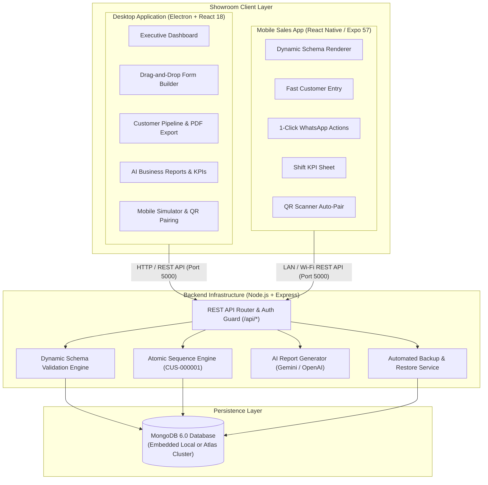

# 🏢 Vasantham Tiles & Sanitary Wares — Customer CRM

<p align="center">
  
</p>

<p align="center">
  <strong>An Enterprise-Grade, Schema-Driven Multi-Platform Showroom CRM Ecosystem</strong>
</p>

<p align="center">
  <a href="#-architecture"></a>
  <a href="#-tech-stack"></a>
  <a href="#-tech-stack"></a>
  <a href="#-tech-stack"></a>
  <a href="#-tech-stack"></a>
  <a href="#-license"></a>
</p>

---

## 📑 Table of Contents

- [Overview](#-overview)
- [Key Features](#-key-features)
  - [1. Desktop CRM & Back-Office Hub](#1-desktop-crm--back-office-hub)
  - [2. Mobile Showroom Sales Floor App](#2-mobile-showroom-sales-floor-app)
  - [3. Backend API & Dynamic Schema Engine](#3-backend-api--dynamic-schema-engine)
- [System Architecture](#-system-architecture)
- [15 Supported Dynamic Field Types](#-15-supported-dynamic-field-types)
- [Tech Stack](#-tech-stack)
- [Project Directory Structure](#-project-directory-structure)
- [Quick Start Guide](#-quick-start-guide)
  - [Prerequisites](#prerequisites)
  - [One-Step Installation](#one-step-installation)
  - [Running the Applications](#running-the-applications)
- [Database Seeding & Automated Tests](#-database-seeding--automated-tests)
- [Default Login Credentials & Access Control](#-default-login-credentials--access-control)
- [Environment Configuration](#-environment-configuration)
- [Packaging Standalone Windows Executable (.exe)](#-packaging-standalone-windows-executable-exe)
- [Mobile Device Pairing via QR Code](#-mobile-device-pairing-via-qr-code)
- [API Reference Snapshot](#-api-reference-snapshot)
- [License & Copyright](#-license--copyright)

---

## 🌟 Overview

**Vasantham CRM** is a purpose-built, high-performance Customer Relationship Management platform engineered specifically for **Vasantham Tiles & Sanitary Wares** (and adaptable for high-volume ceramic tile, bathware, sanitaryware showrooms, and building material distributors).

Showrooms face unique operational challenges:
- High foot-traffic walk-ins requiring rapid, frictionless mobile data entry on the sales floor.
- Multi-month construction project lifecycles (Foundation ➔ Brickwork ➔ Plastering ➔ Flooring ➔ Painting ➔ Completion).
- Evolving business requirements demanding dynamic form updates without mobile app store updates or redeployments.
- Coordinated follow-ups across sales executives with quotation tracking and lost sales intelligence.
- Zero-dependency local desktop deployments that run seamlessly offline with embedded databases.

Vasantham CRM solves this with a **unified 3-tier ecosystem**: a **Native Windows Desktop Hub**, an **Agile Mobile Sales Floor App**, and an **Intelligent Express/MongoDB Backend**.

---

## 🚀 Key Features

### 1. Desktop CRM & Back-Office Hub
*Powered by Electron, React 18, Vite, and Lucide React*

- **Executive Analytics Dashboard**: Real-time sales conversion funnels, walk-in trends, lead sources (Engineers, Architects, Masons, Walk-ins), and monthly revenue milestones.
- **Dynamic Drag-and-Drop Form Builder**: Visually design, reorder, validate, and publish customer intake schemas across 15 distinct field types with zero code changes.
- **Interactive Live Previews**: Test dynamic forms in both Desktop and interactive Phone Mockup simulator directly within the desktop interface.
- **Customer Directory & Pipeline Table**: Multi-column sorting, deep search, fuzzy filtering, customer lifecycle stages, and 1-click CSV/PDF export (using `jspdf` and `jspdf-autotable`).
- **Showroom Shift KPIs & Sales Targets**: Track executive targets, walk-ins handled, conversion rates, and closed deal values per staff member.
- **Follow-up Calendar & Schedule Sheet**: Color-coded overdue, today, and upcoming customer revisit dates with instant WhatsApp communication triggers.
- **Lost Sales Intelligence**: Track reasons for lost deals (price competition, brand unavailability, delays) to eliminate revenue leaks.
- **Showroom Staff & Access Control**: Manage showroom owners, managers, and sales executives with Role-Based Access Control (RBAC).
- **Showroom Branding Studio**: Customize showroom name, taglines, logo, and brand primary color dynamically across both desktop and mobile apps.
- **AI-Powered Business Reports**: Multi-model intelligence (Gemini & OpenAI) generating deep strategic insights on showroom performance, customer conversion, and inventory demands.
- **Embedded Database & Standalone Operation**: Automatically launches and manages bundled MongoDB 6.0 and Express backend processes without third-party installations.

---

### 2. Mobile Showroom Sales Floor App
*Powered by React Native, Expo SDK 57, and AsyncStorage*

- **100% Schema-Driven Form Engine**: The mobile app consumes published MongoDB schemas dynamically—new fields, labels, placeholders, or validation rules appear instantly without updating the app.
- **Clean, Minimalist Sales Rep UI**: Designed specifically for fast customer intake during showroom walk-throughs with high contrast, legible typography, and distraction-free entry fields.
- **1-Click WhatsApp Integration**: Pre-templated WhatsApp chats for quotations, catalogs, follow-ups, and order confirmations directly from the customer record.
- **Instant LAN QR Code Pairing**: Showroom staff can scan the pairing QR code from the Desktop app to link their mobile device to the local CRM server in seconds.
- **Mobile Shift KPI Tracker**: Sales executives can view their daily targets, walk-ins logged, quotations generated, and pipeline conversion on the go.
- **Quick Status Transitions**: Smooth transitions from *Walk-in* ➔ *Quotation* ➔ *Negotiation* ➔ *Order Confirmed* (with celebratory feedback).
- **Offline Resilient**: Local caching via `AsyncStorage` ensures form schemas and drafts remain accessible even with intermittent Wi-Fi.

---

### 3. Backend API & Dynamic Schema Engine
*Powered by Node.js, Express, Mongoose, and MongoDB*

- **Dynamic Validation Engine**: Validates client submissions against active schema constraints (types, min/max limits, regex patterns, required flags) server-side.
- **Atomic Sequence Generator**: Concurrency-safe customer code generation (e.g., `CUS-000001` or `VAS-000001`) with configurable prefixes, zero-padding, and step increments.
- **Automated Backup & Restore Engine**: Automated scheduled dumps, manual JSON/CSV exports, and disaster recovery restore tools.
- **Network Resilience & Connection Guards**: Automatic reconnection guards for MongoDB and network interface IP auto-sync for seamless LAN mobile access.
- **JWT Authentication & RBAC**: Secure JSON Web Tokens with strict role isolation between Showroom Owners and Sales Staff.

---

## 📐 System Architecture



---

## 🎛️ 15 Supported Dynamic Field Types

The Form Builder engine enables showroom administrators to build custom customer intake forms using any combination of the following 15 field types:

| # | Field Type | Identifier | Showroom Use Case | Validation & Constraints |
|---|---|---|---|---|
| **1** | **Single-Line Text** | `text` | Customer Name, Site Address, Architect Name | Min/Max character lengths |
| **2** | **Paragraph / Long Text** | `textarea` | Special Notes, Delivery Directions, Tile Preferences | Multi-line text support |
| **3** | **Number** | `number` | Approx. Area (Sq.Ft), Bathrooms Count | Min/Max numerical bounds |
| **4** | **Phone Number** | `phone` | Primary & Alternate Mobile Numbers | Strict 10-digit Indian Mobile regex |
| **5** | **Email Address** | `email` | Invoicing & Quotation Email | RFC 5322 email pattern |
| **6** | **Date Picker** | `date` | Visit Date, Expected Delivery Date | ISO 8601 Date format (`YYYY-MM-DD`) |
| **7** | **Time Picker** | `time` | Preferred Call Time, Appointment Slot | Standard `HH:mm` format |
| **8** | **Date & Time Picker** | `datetime` | Scheduled Site Inspection Appointment | Full ISO datetime timestamp |
| **9** | **Checkbox (Boolean)** | `checkbox` | Sanitary Required, Tile Adhesive Required | True / False boolean toggle |
| **10** | **Radio Button Group** | `radio` | Decision Maker (Owner / Contractor / Architect) | Single select from configured list |
| **11** | **Single Dropdown Select** | `select` | House Construction Stage, Lead Source | Single option picker |
| **12** | **Multi-Select Chips** | `multiselect` | Requirement Categories (Tiles, Sanitary, CP Fittings) | Array of selected option tags |
| **13** | **Currency Amount** | `currency` | Tile Budget, Quotation Value, Advance Paid | Indian Rupee (`₹`) with formatting |
| **14** | **Website / URL** | `url` | Builder Portfolio, Architect Website | Standard URL regex validation |
| **15** | **Auto-Generated Sequence** | `auto_number` | Unique Customer ID (`CUS-000001`) | Backend atomic increment (read-only) |

---

## 💻 Tech Stack

### Desktop Application
- **Runtime & Packaging**: [Electron 30](https://www.electronjs.org/) + [electron-builder](https://www.electron.build/) (NSIS Installer & Portable Windows `.exe`)
- **Frontend Framework**: [React 18](https://react.dev/) + [Vite 5](https://vitejs.dev/)
- **Styling**: Modular Vanilla CSS Design System with Showroom Theme Variables
- **Icons**: [Lucide React](https://lucide.dev/)
- **Export & Utility**: [jsPDF](https://github.com/parallax/jsPDF) & [jspdf-autotable](https://github.com/simonbengtsson/jsPDF-AutoTable), [qrcode.react](https://github.com/zpao/qrcode.react)

### Mobile Application
- **Framework**: [React Native 0.86](https://reactnative.dev/) (React 19)
- **Tooling**: [Expo SDK 57](https://expo.dev/)
- **Camera & Barcode**: `expo-camera` (QR Pairing)
- **Local Cache**: `@react-native-async-storage/async-storage`
- **Gradients & Vector Icons**: `expo-linear-gradient`, `@expo/vector-icons`

### Backend API & Database
- **Server Framework**: [Node.js](https://nodejs.org/) & [Express 4](https://expressjs.com/)
- **Database & ODM**: [MongoDB 6.0](https://www.mongodb.com/) & [Mongoose 8](https://mongoosejs.com/)
- **Security & Auth**: [JSON Web Tokens (jsonwebtoken)](https://jwt.io/), [bcryptjs](https://github.com/dcodeIO/bcrypt.js)
- **AI Analytics**: Google Gemini Pro & OpenAI API Integrations

---

## 📂 Project Directory Structure

```text
customer-relationship-management/
├── backend/                        # Node.js Express REST API
│   ├── bin/                        # Embedded MongoDB binaries & tools
│   ├── src/
│   │   ├── config/                 # Database & environment configurations
│   │   ├── controllers/            # API Controllers (Auth, Forms, Customers, KPIs, AI)
│   │   ├── middlewares/            # JWT Auth guards, DB connection monitors
│   │   ├── models/                 # Mongoose schemas (Customer, Form, KPI, LostSale, User)
│   │   ├── routes/                 # Express endpoint routes
│   │   ├── services/               # AI analytics services (Gemini / OpenAI)
│   │   ├── tests/                  # Automated integration test suite
│   │   └── utils/                  # Database seeders (seedData.js, seedSamples.js)
│   ├── .env.example                # Backend environment configuration template
│   └── package.json
│
├── desktop/                        # Electron + React + Vite Desktop Application
│   ├── electron/                   # Electron main process (main.cjs) & window managers
│   ├── public/                     # App icons, logos, and static assets
│   ├── src/
│   │   ├── components/             # UI Components
│   │   │   ├── auth/               # Login & authentication modals
│   │   │   ├── customer-crm/       # Customer table, search, filters & export
│   │   │   ├── dashboard/          # Executive dashboard & metrics
│   │   │   ├── employees/          # Staff management views
│   │   │   ├── followups/          # Follow-up schedule sheet
│   │   │   ├── form-builder/       # Dynamic 15-field drag-and-drop builder
│   │   │   ├── form-preview/       # Live desktop & mobile schema previewer
│   │   │   ├── kpi/                # Daily showroom shift KPI tracker
│   │   │   ├── layout/             # Collapsible Sidebar & Header
│   │   │   ├── lost-sales/         # Lost sales intelligence center
│   │   │   ├── mobile-pairing/     # Showroom LAN QR code pairing engine
│   │   │   ├── mobile-simulator/   # Interactive phone simulator overlay
│   │   │   ├── reports/            # PDF and AI business report generator
│   │   │   └── settings/           # Sequence setup, branding & backup tools
│   │   ├── context/                # React Contexts (Auth, Branding, Customer)
│   │   ├── services/               # API client service layer
│   │   ├── styles/                 # Global styling system & theme variables
│   │   └── App.jsx                 # Main application controller
│   ├── start-desktop.js            # Desktop dev orchestrator (DB + Backend + Frontend + Window)
│   └── package.json
│
├── mobile/                         # React Native Expo Mobile Showroom Floor App
│   ├── assets/                     # Mobile splash, icons, and logo
│   ├── src/
│   │   ├── api/                    # API client with auto-discovery & fallbacks
│   │   ├── components/             # Dynamic field renderers, QR scanner, KPI sheets
│   │   └── theme/                  # Showroom color palettes & typography tokens
│   ├── App.js                      # Main mobile showroom application
│   └── package.json
│
├── scripts/                        # Standalone utility scripts
│   └── setup-bundled-mongodb.js    # Downloads & bundles portable MongoDB 6.0 for Windows
├── package.json                    # Root workspace manager & unified launch scripts
└── README.md                       # Master Documentation
```

---

## ⚡ Quick Start Guide

### Prerequisites
- [Node.js](https://nodejs.org/) (v18.x or v20.x LTS recommended)
- [npm](https://www.npmjs.com/) (v9.x or later)
- [Git](https://git-scm.com/)
- *(Optional)* [Expo Go App](https://expo.dev/go) on your iOS or Android device for mobile testing.
- *(Note)* You do **NOT** need to install MongoDB separately on Windows—the desktop environment can automatically download and run its own embedded MongoDB 6.0 instance!

---

### One-Step Installation
Clone the repository and install all dependencies across root, backend, desktop, and mobile in one command:

```bash
git clone https://github.com/varun-8/customer-relationship-management.git
cd customer-relationship-management
npm run install:all
```

---

### Running the Applications

#### Mode 1: Unified Desktop Mode (Recommended for Desktop Users)
Starts the backend, checks/spawns the local database, and launches the **Native Desktop Application Window**:
```bash
npm run dev
```

#### Mode 2: Browser Mode (Web Development)
Launches the Backend API and runs the Desktop UI in your favorite standard web browser:
```bash
npm run dev:browser
# Backend running on http://localhost:5000
# Web CRM accessible on http://localhost:5173
```

#### Mode 3: Mobile Application (Showroom Tablet / Phone)
Starts the Expo development server:
```bash
npm run dev:mobile
```
*Scan the generated QR code in your terminal or browser using the **Expo Go** app (Android/iOS).*

#### Mode 4: Full Stack Parallel Execution
Runs Backend, Desktop Frontend, and Mobile Expo simultaneously:
```bash
npm run dev:all
```

---

## 🧪 Database Seeding & Automated Tests

### 1. Seeding Default Showroom Data
Populate the database with initial showroom owner, staff credentials, default 23-field specification, customer code sequence, and sample customers:
```bash
npm run seed
```
To insert richer sample datasets for sales analytics and reports:
```bash
npm --prefix backend run seed:samples
```

### 2. Running Automated Backend Test Suite
Executes the comprehensive API test suite covering health checks, authentication, schema validation, customer creation, and sequence generation:
```bash
npm test
```

---

## 🔐 Default Login Credentials & Access Control

The database is pre-seeded with two primary showroom access roles:

| Role | Email | Password | Permissions & Scope |
|---|---|---|---|
| **Showroom Owner / Admin** | `owner@vasantham.com` | `admin123` | **Full Access**: Dynamic Form Builder, Sequence Config, Staff Management, AI Reports, Database Backups, Branding Customization |
| **Sales Executive / Staff** | `employee@vasantham.com` | `employee123` | **Sales Floor Access**: Customer Intake, Follow-ups, Quotations, Lost Sales Intel, Personal Shift KPIs, QR Pairing |

> [!TIP]
> You can customize admin credentials anytime in `backend/.env` using the `ADMIN_USERNAME` and `ADMIN_PASSWORD` keys.

---

## ⚙️ Environment Configuration

### Backend Configuration (`backend/.env`)
Create a `.env` file in the `backend/` directory (see `backend/.env.example`):
```env
PORT=5000
MONGODB_URI=mongodb://127.0.0.1:27017/vasantham_crm
JWT_SECRET=vasantham_jwt_super_secret_key_2026
DEV_KEY=vasantham_developer_secret_wipe_key_2026
NODE_ENV=development

# Optional AI Reporting Keys (Leave blank to use internal analytics engine)
GEMINI_API_KEY=your_gemini_api_key_here
OPENAI_API_KEY=your_openai_api_key_here
```

### Desktop Configuration (`desktop/.env`)
```env
VITE_SERVER_IP=localhost
VITE_API_URL=http://localhost:5000/api
```

### Mobile Configuration (`mobile/.env`)
When testing on a physical mobile device on the showroom floor, point the mobile app to your desktop server's local network IP:
```env
EXPO_PUBLIC_SERVER_IP=192.168.1.100
EXPO_PUBLIC_API_URL=http://192.168.1.100:5000/api
```
*(Alternatively, use the built-in QR Code Scanner in the mobile app to connect automatically without manual configuration).*

---

## 📦 Packaging Standalone Windows Executable (.exe)

Vasantham CRM includes a zero-dependency bundler that packages the Electron desktop application, Express backend, and portable MongoDB 6.0 into a standalone Windows installer:

```bash
# Downloads MongoDB binary and builds Windows installer (.exe) in desktop/dist-exe/
npm run build:exe
```

This creates:
- **`Vasantham CRM Setup 1.0.0.exe`**: Complete NSIS Windows installer with desktop shortcut and uninstaller.
- **Portable `.exe`**: Single executable requiring zero installation.

---

## 📱 Mobile Device Pairing via QR Code

Connecting showroom floor tablets or mobile phones to the back-office desktop takes just two steps:

1. In the **Desktop App**, navigate to the **Mobile Scanner / Pairing** tab.
2. A pairing QR code will be generated containing your local network server address and connection token.
3. Open the **Mobile App**, tap **Scan Desktop QR**, and scan the screen. The mobile app connects immediately and syncs all active form fields.

---

## 📡 API Reference Snapshot

| Method | Endpoint | Description | Access |
|---|---|---|---|
| `GET` | `/api/health` | Service health & database connectivity status | Public |
| `POST` | `/api/auth/login` | Staff & Owner authentication, returns JWT | Public |
| `GET` | `/api/customer-form/active` | Retrieves published dynamic customer form schema | Authenticated |
| `POST` | `/api/customer-form/publish` | Publishes new schema version to desktop & mobile | Owner Only |
| `GET` | `/api/customers` | Paginated customer list with search & filter | Authenticated |
| `POST` | `/api/customers` | Creates new customer record with dynamic validation | Authenticated |
| `PUT` | `/api/customers/:id` | Updates customer details, quotation or stage | Authenticated |
| `GET` | `/api/kpi/summary` | Showroom daily shift performance & conversion KPIs | Authenticated |
| `POST` | `/api/lost-sales` | Records lost sale reasons & competitor notes | Authenticated |
| `GET` | `/api/sequence/customer_id` | Retrieves current customer sequence configuration | Authenticated |
| `POST` | `/api/ai-reports/generate` | Generates comprehensive showroom business analysis | Owner Only |
| `GET` | `/api/backup/export` | Generates complete database backup snapshot | Owner Only |

---

## 📄 License & Copyright

Copyright © 2026 **Vasantham Tiles & Sanitary Wares**. All rights reserved.  
Built with pride for high-performance showroom retail operations.